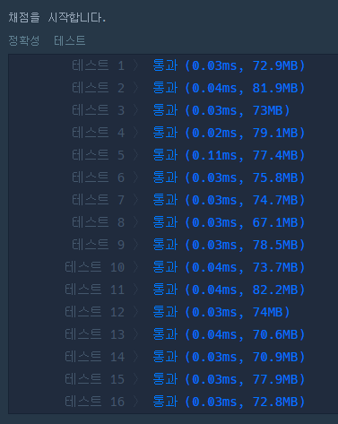
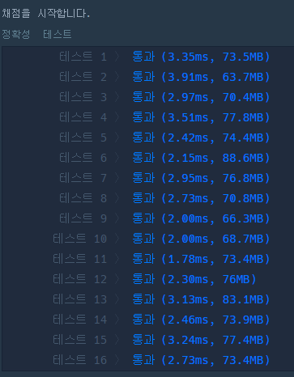
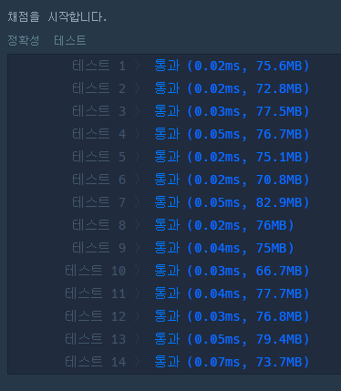
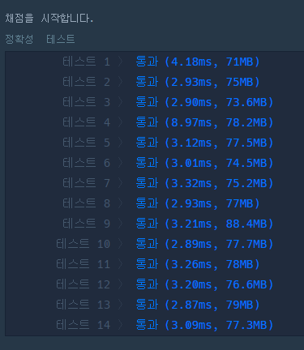
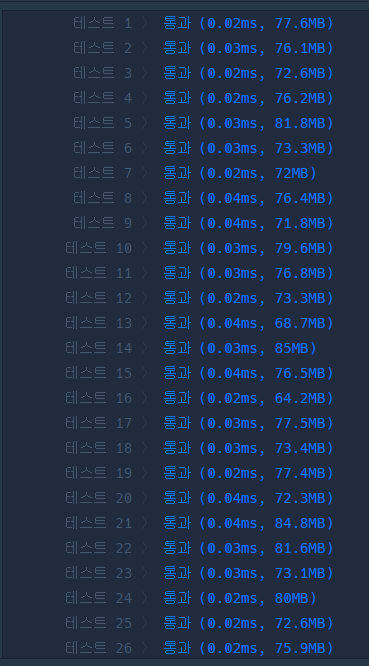
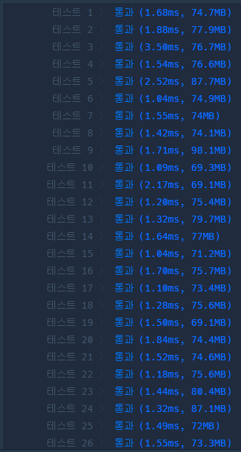

## 평균 구하기
```java
public class avgCalculation {
	public static double solution(int[] arr) {
		double answer = 0;
		double sum = 0;

		for(int i = 0; i < arr.length; i++){
			sum += arr[i];
		}

		answer = sum / arr.length;
		return answer;
	}

	public static double streamSolution(int[] arr){
		return Arrays.stream(arr).average().orElse(0); // 
	}
}
```
- `Arrays.stream(arr)` : 배열을 스트림으로 변환
- `.average()` : 스트림 객체에 연속된 숫자가 들어있는 경우 호출 가능, 스트림에 있는 모든 요소의 평균값을 계산
- `.orElse(0)`
  - average()의 결과는 OptionalDouble타입이며, 스트림이 비어있는 경우 아무값도 반환하지 않을 수 있음
  - 스트림이 비어있을 경우 0을 기본값으로 설정
### for 채점 결과

### stream 채점 결과

## x만큼 간격이 있는 n개의 숫자
```java
package day2;
import java.util.stream.LongStream;

public class xIntervalN {
	public long[] solution(int x, int n) {
		long[] answer = new long[n];
		long sum = 0;

		for(int i = 0; i < n; i++){
			sum += x;
			answer[i] = sum;
		}
		return answer;
	}

	public long[] streamSolution(int x, int n){
		return LongStream.range(1, n + 1).map(i -> i * x).toArray();
	}
}
```
- `LongStream.range(1, n + 1)` : 1부터 n까지의 연속된 숫자 스트림 생성, 종료값(n+1)은 포함되지 않는다.
- `.map(i -> i * x)` : 생성된 스트림의 각 요소를 람다를 사용하여 각 요소에 x를 곱함, x의 배수롤 나타내는 스트림 생성
- `.toArray()` : 스트림의 모든 요소를 배열로 반환
### for 채점 결과

### stream 채점 결과

## 문자열 내 p와 y의 개수
```java
package day2;

public class pyCount {
	boolean solution(String s) {
		boolean answer = true;
		int pcnt = 0;
		int ycnt = 0;

		for(int i=0; i<s.length(); i++){
			char c = s.charAt(i);
			if(c == 'p' || c == 'P'){
				pcnt++;
			}else if(c == 'y' || c == 'Y'){
				ycnt++;
			}
		}

		if(pcnt != ycnt){
			answer = false;
		}

		return answer;
	}

	boolean streamSolution(String s) {
		long pcnt = s.chars()
			.filter(c -> c == 'p' || c == 'P')
			.count();

		long ycnt = s.chars()
			.filter(c -> c == 'y' || c == 'Y')
			.count();

		return pcnt == ycnt;
	}
}

```
- `s.chars()` : 문자열 s를 문자 스트림으로 변환 
- `.filter(c -> c == 'p' || c == 'P')`
  - 스트림 각 문자에 대해 filter 메소드를 사용하여 조건을 적용
  - 문자 c가 p이거나 P인 경우를 필터링하여 스트림 생성
- `.count()` : 스트림에 있는 요소의 개수를 계산하여 반환
### for 채점 결과

### stream 채점 결과

